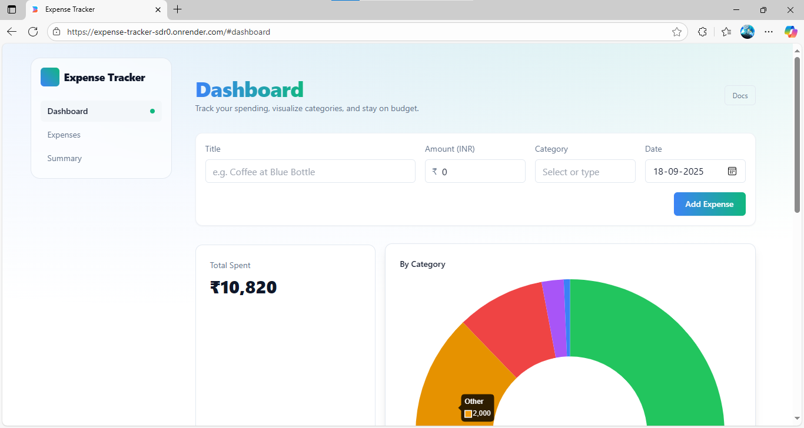

# 💰 Expense Tracker Application

A comprehensive full-stack expense tracking application built with modern web technologies. Users can add, categorize, and visualize their expenses through an intuitive dashboard interface.

## 🌟 Features

### For Users
- **Add & Track**: Log expenses with title, amount, category, and date
- **Visualize Spending**: Interactive charts showing expense distribution by category
- **Expense Management**: View, filter, and delete expense entries
- **Responsive Design**: Optimized for all device sizes
- **Single-Page Experience**: Navigate between sections without page reloads

### For Developers
- **In-Memory Fallback**: Works without database configuration for quick demos
- **API Integration**: Well-documented endpoints for expense management
- **Modern UI Components**: Built with Tailwind CSS and React
- **Deployment Ready**: Configured for Netlify and Render deployment

## 🛠 Tech Stack

### Backend
- **Node.js + Express**: RESTful API server
- **MongoDB**: Database with Mongoose ODM (with in-memory fallback)
- **TypeScript**: Type-safe development
- **Express Middleware**: Error handling and request processing

### Frontend
- **React 18**: Modern UI with hooks
- **TailwindCSS**: Utility-first styling
- **React Query**: Data fetching and state management
- **Chart.js**: Interactive data visualization
- **React Router**: Client-side routing

## 🚀 Quick Start

### Prerequisites
- Node.js 16+ and pnpm
- MongoDB Atlas account (optional)
- Git

### Installation

1. Clone the repository
```bash
git clone <repository-url>
cd expense-tracker
```

2. Install dependencies
```bash
pnpm install
```

3. Environment Setup
```bash
# Create .env file with the following variables
MONGODB_URI=your_mongodb_connection_string
MONGODB_DB_NAME=your_database_name
PING_MESSAGE="API is running"
```

4. Start Development Server
```bash
pnpm dev
```
This runs both frontend (port 5173) and backend concurrently.

## 📊 API Endpoints

### Expenses
- **GET /api/expenses** - Get all expenses
- **POST /api/expenses** - Add new expense
  ```json
  {
    "title": "Groceries",
    "amount": 45.75,
    "category": "Food",
    "date": "2023-05-15T00:00:00.000Z"
  }
  ```
- **DELETE /api/expenses/:id** - Delete expense by ID
- **GET /api/expenses/summary** - Get expense summary statistics

## 🏗 Project Structure

```
├── client/                  # React SPA frontend
│   ├── components/          # UI components
│   │   ├── expense/         # Expense-related components
│   │   │   ├── AddExpenseForm.tsx
│   │   │   ├── ExpenseList.tsx
│   │   │   └── SummarySection.tsx
│   │   ├── layout/         # Layout components
│   │   │   └── DashboardLayout.tsx
│   │   └── ui/             # Reusable UI components
│   ├── hooks/              # Custom React hooks
│   ├── lib/                # Utility functions
│   ├── pages/              # Page components
│   │   ├── Index.tsx       # Main dashboard page
│   │   └── NotFound.tsx    # 404 page
│   └── services/           # API service functions
│       └── expenses.ts     # Expense API client
│
├── server/                 # Express API server
│   ├── config/             # Configuration files
│   │   └── db.ts           # MongoDB connection
│   ├── controllers/        # Request handlers
│   │   └── expenseController.ts
│   ├── models/             # Database models
│   │   └── Expense.ts      # Expense schema
│   └── routes/             # API routes
│       └── expenses.ts     # Expense endpoints
│
├── shared/                 # Shared code
│   └── api.ts              # Shared types and interfaces
│
├── netlify/                # Netlify deployment
│   └── functions/          # Serverless functions
│       └── api.ts          # API handler
│
│── Demo.png            # Application screenshot
│
├── netlify.toml            # Netlify configuration
├── package.json            # Dependencies and scripts
├── tailwind.config.ts      # Tailwind CSS configuration
└── vite.config.ts          # Vite build configuration
```

## 📱 Application Demo



*Screenshot of the deployed application showing the expense dashboard with chart visualization.*

## 🚀 Deployment

### Backend (Render)
1. Create a new Render Web Service
2. Connect your repository to Render
3. Set environment variables in Render dashboard
4. Build Command: `pnpm install && pnpm build:server`
5. Start Command: `pnpm start`

### Frontend (Netlify)
1. Create a new Netlify project
2. Build Command: `pnpm build:client`
3. Publish directory: `dist/spa`
4. Set environment variables if needed

## 🔗 Live Deployment Links

- Frontend: [Netlify Deployment](https://expense-tracker-sdr0.onrender.com/)
- Backend API: [Render Deployment](https://expense-tracker-sdr0.onrender.com/api)
